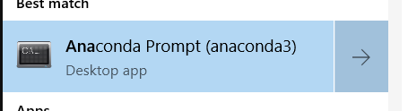
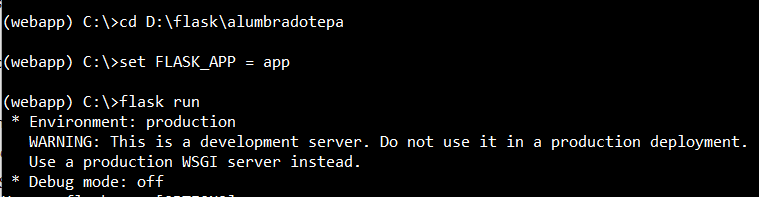
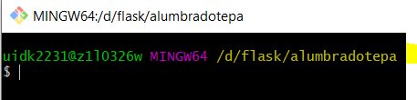

# Instalación 

## Instalar Miniconda 

* Este es el enlace a la decarga [Miniconda]: 

[Minicionda] : https://docs.conda.io/en/latest/miniconda.html


## Configurar Miniconda

* Una vez que lo hayas instalado, busca el bash de miniconda, 
* escribiendo en el inicio de Windows Minoconda, deberás ver algo como la imagen

 

* Ejecutas la consolo en modo administrador y pruebas que funcione, mendiante los siguientes comandos:

```bash
conda info --show 
conda update
```

## Crear el ambiente de anaconda 

* Desde la consola, deberás ejecutar las siguientes instrucciones para crear el ambiente
* (el ambiente se refiere a las librerías que la app necesita para funcionar), entonces
* ejecutas los siguientes comandos:
```bash
conda activate base
conda remove --name webapp --all
conda create --name webapp --file webenv.txt
```
* Esto debería poder crear el ambiente

## Ejecutar la aplicación

* Una vez que hayas instalado correctamente, deberás ejecutar la app, 

* debes de estar en la raiz del proyecto, es decir 

 

```bash
conda activate webapp 
set FLASK_APP = app
flask run 
```

## Actualizar repositorio

* Desde la consolo de git y en la raíz del proyecto

 

* debes de ejecutar la siguiente instrucción:
```bash
git pull 
```
* y deberías tener actualizado el repositorio
